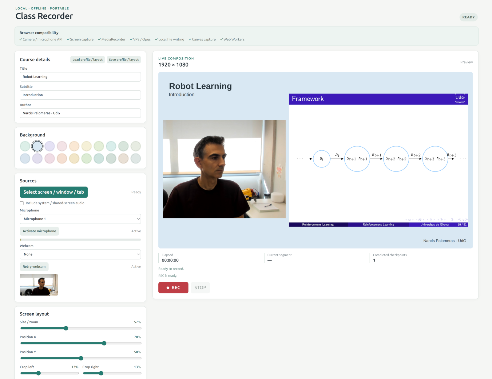

# Portable Class Recorder

A completely local, dependency-free Chrome application for recording any combination of display, microphone, and webcam, with optional shared audio. Video recordings use a 1920×1080 composition; microphone-only recordings contain just audio.

Created by Narcís Palomeras.

## Use

1. Copy the whole folder to the USB drive and open index.html in current desktop Google Chrome on Windows.
2. Check the compatibility panel, choose an output folder, and activate at least one source: screen/window/tab, microphone, or webcam. Chrome requests the required device permissions. Select None to disable the microphone or webcam, or Disable screen to clear screen capture.
3. Press REC. Any one source, any pair, or all three can be recorded. Chrome's native capture chooser controls which display and shared audio are available.
4. Press STOP. The app safely closes the current part and remuxes saved WebM parts into the final file in the session folder.

No web server, account, network request, CDN, installation, or runtime package is used.

## Recovery and output

The recorder emits data every five seconds and closes an independent recording-part-###.webm recovery checkpoint every **15 seconds**. File System Access writes are committed when the writer closes, so emitting data alone is not a durable checkpoint. If Chrome or Windows stops, already closed parts remain playable in the session folder; the current unclosed part may be lost. A busy PC or slow disk can delay checkpoints, so 15 seconds is a target, not a guaranteed maximum loss.

After reopening the app, click **Recover a recording from its session folder** and select the folder containing recording-part-###.webm files. The app merges readable parts into a new *-recovered.webm file, reports damaged parts that it skips, ignores empty files, and keeps all originals. This also works with completed parts from older versions. Data that was never committed by the old version cannot be recovered this way.

The final merge is local and does not re-encode video or audio. lib/webm-remuxer.js is project-local MIT-licensed code that copies VP8/Opus packet data, rebases WebM cluster timestamps, and writes duration and cue metadata. Temporary files are kept by default; select the deletion checkbox only when you have verified the final recording.

The Destination panel has five video-quality levels. Balanced is the default at 2.1 Mbps video plus 128 kbps audio (about 1.00 GB/hour at the configured bitrate), reduced from the original 3.5 Mbps video setting. Static slides can use less than these estimates.

## Notes

- The recording and preview use the exact same 1920×1080 canvas renderer.
- Screen capture, webcam capture, and the canvas stream request at most 25 fps. Screen capture requests at most 1920×1080; the webcam requests at most 1280×720. Actual frame delivery can be lower under load.
- The worker supplies 25 fps render ticks and explicitly requests canvas frames, independently of animation frames. Only one unacknowledged tick can be outstanding: if the page stalls, missed frames are dropped rather than queued for later rendering.
- The microphone meter updates at 10 Hz, the recording dashboard at 1 Hz, and text sizing is cached to reduce work during long recordings.
- Webcam and microphone disconnections do not stop the recording. During recording, the app retries the selected disconnected device every five seconds; a reconnected microphone rejoins the existing audio mix. A temporarily muted camera is omitted until its signal returns. If all sources disappear, the session continues with background/silence until a device reconnects or you press STOP. Screen sharing requires a new user selection after finishing the session.
- Unexpected encoder stops are finalized and restarted. An encoder that cannot stop within five seconds is abandoned and replaced; after repeated failures the app stops and preserves earlier checkpoints.
- Pending file writes are limited to 32 MiB, with at most two checkpoints being finalized at once. Disk operations time out after 15 seconds. A failing/full/disconnected destination stops recording with an error and keeps completed parts rather than growing an unlimited queue. Choose a reliable local disk for the recording destination when USB storage is slow.
- Closing or refreshing the page during recording or finalization triggers Chrome's unsaved-work prompt.
- Device IDs and output folder handles are never written to portable profile files.
- Screen layout has independent left/right/top/bottom crop controls to remove captured projector margins.
- Screen and webcam zoom both range from 10% to 150%.
- The background palette includes white and black alongside a reduced set of pastel colors.
- Text layout has independent X, Y, and scale controls for title, subtitle, and author.
- Save profile / layout includes the screen and webcam transforms/crops, text positions/scales, colors, quality, and metadata; Load profile / layout restores them.
- Shared/system audio depends on the Chrome chooser and the selected capture source. When it is unavailable, microphone-only recording continues.

## Verification

Run `node tests/reliability.test.js` for frame-backlog, final-event ordering, rollover/STOP, writer-error, queue-limit and timeout checks. Run `node tests/browser-recording.js` with desktop Chrome, ffprobe and ffmpeg installed for real MediaRecorder, reconnection, temporary filesystem, crash/recovery and video-decoding checks. `CHROME_BIN` can select a Chrome executable. The browser test uses fake devices, an isolated temporary profile and a loopback-only fixture server; the application itself remains entirely offline and server-free.

## License

MIT. See LICENSE.

---
_Narcís Palomeras_
